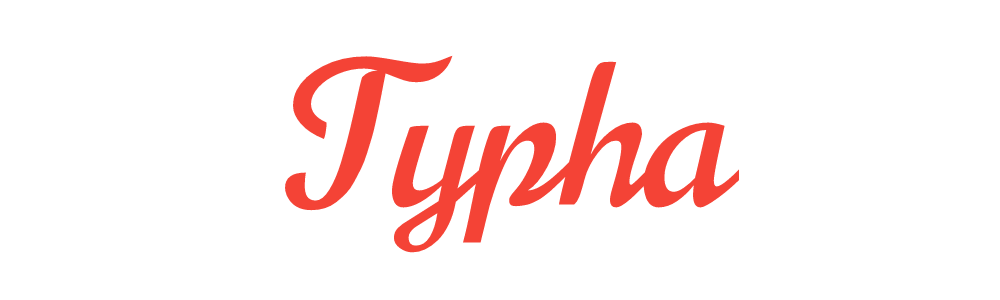

> Web version of Typha.
<hr>


> The web version of typha uses Raul Dronca's <a href="https://github.com/iRaul/vue-minimal-todo">vue-minimal-todo</a> template as a starting template.

## Build Setup

``` bash
# install dependencies
npm install

# serve with hot reload at localhost:8080
npm run dev

# build for production with minification
npm run build
```

## Authors

- Andre Sion (<a href="https://twitter.com/caxvis">@caxvis</a>)